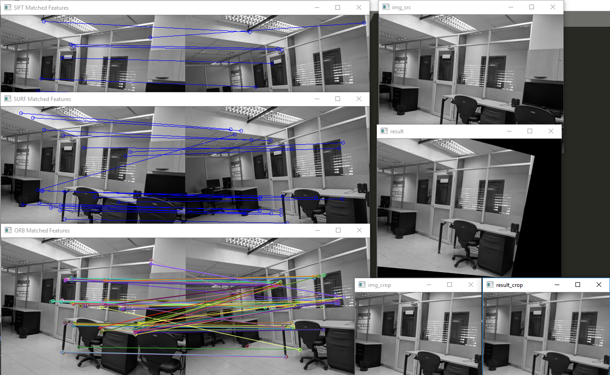

You must use opencv version 3.4.2.16 and also opencv contribution 3.4.2.16

```
py -m pip install opencv-python==3.4.2.16
py -m pip install opencv-contrib-python==3.4.2.16
```

# FeatureMap

Using SIFT, SURF and ORB to get the feature map (characteric point of each image), the respective resize, rotation, transformation, desformation is made, and then crop the intersection between the two image, getting two image registered bitwise.

## Methodology
Having two similar image, maybe toked with two differents camera, each one will get their feature maps (SIFT, SURF, ORB), ie.

Image Camera1


Image Camera2


After both image has their feature map, the respective transformation is done to adjust both image


## RESULT

